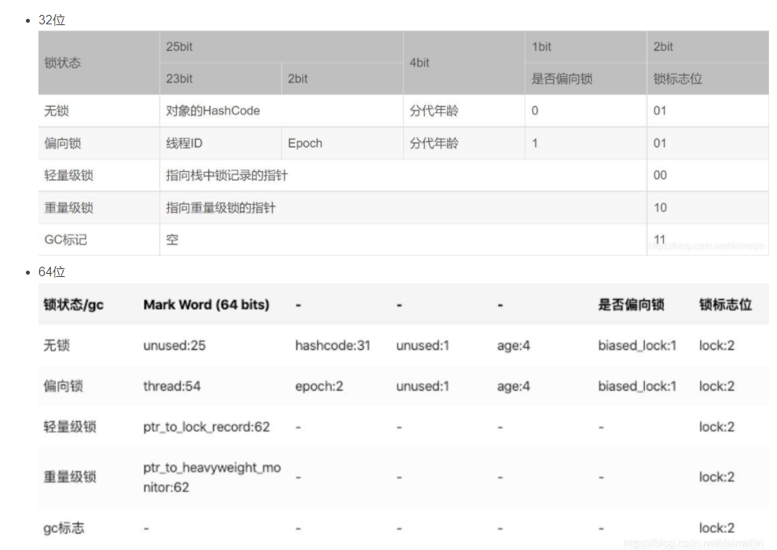

# 使用JavaAgent测试Object的大小


## 对象大小（64位机）

### 观察虚拟机配置

java -XX:+PrintCommandLineFlags -version

### 普通对象

1. 对象头：markword  8
2. ClassPointer指针：-XX:+UseCompressedClassPointers 为4字节 不开启为8字节
3. 实例数据
   1. 引用类型：-XX:+UseCompressedOops 为4字节 不开启为8字节 
      Oops Ordinary Object Pointers
4. Padding对齐，8的倍数

### 数组对象

1. 对象头：markword 8
2. ClassPointer指针同上
3. 数组长度：4字节
4. 数组数据
5. 对齐 8的倍数

### mark word结构


## 实验

1. 新建项目ObjectSize （1.8）

2. 创建文件ObjectSizeAgent

   ```java
   package com.mashibing.jvm.agent;
   
   import java.lang.instrument.Instrumentation;
   
   public class ObjectSizeAgent {
       private static Instrumentation inst;
   
       public static void premain(String agentArgs, Instrumentation _inst) {
           inst = _inst;
       }
   
       public static long sizeOf(Object o) {
           return inst.getObjectSize(o);
       }
   }
   ```

3. src目录下创建META-INF/MANIFEST.MF

   ```java
   Manifest-Version: 1.0
   Created-By: mashibing.com
   Premain-Class: com.mashibing.jvm.agent.ObjectSizeAgent
   ```

   注意Premain-Class这行必须是新的一行（回车 + 换行），确认idea不能有任何错误提示

4. 打包jar文件

5. 在需要使用该Agent Jar的项目中引入该Jar包
   project structure - project settings - library 添加该jar包

6. 运行时需要该Agent Jar的类，加入参数：

   ```java
   -javaagent:C:\work\ijprojects\ObjectSize\out\artifacts\ObjectSize_jar\ObjectSize.jar
   ```

7. 如何使用该类：

   ```java
   ​```java
      package com.mashibing.jvm.c3_jmm;
      
      import com.mashibing.jvm.agent.ObjectSizeAgent;
      
      public class T03_SizeOfAnObject {
          public static void main(String[] args) {
              System.out.println(ObjectSizeAgent.sizeOf(new Object()));
              System.out.println(ObjectSizeAgent.sizeOf(new int[] {}));
              System.out.println(ObjectSizeAgent.sizeOf(new P()));
          }
      
          private static class P {
                              //8 _markword
                              //4 _oop指针
              int id;         //4
              String name;    //4
              int age;        //4
      
              byte b1;        //1
              byte b2;        //1
      
              Object o;       //4
              byte b3;        //1
      
          }
      }
   ```

## Hotspot开启内存压缩的规则（64位机）

1. 4G以下，直接砍掉高32位
2. 4G - 32G，默认开启内存压缩 ClassPointers Oops
3. 32G，压缩无效，使用64位
   内存并不是越大越好（^-^）

## IdentityHashCode的问题

回答白马非马的问题：

当一个对象计算过identityHashCode之后，不能进入偏向锁状态

https://cloud.tencent.com/developer/article/1480590
 https://cloud.tencent.com/developer/article/1484167

https://cloud.tencent.com/developer/article/1485795

https://cloud.tencent.com/developer/article/1482500

## 对象定位

•https://blog.csdn.net/clover_lily/article/details/80095580

1. 句柄池
2. 直接指针